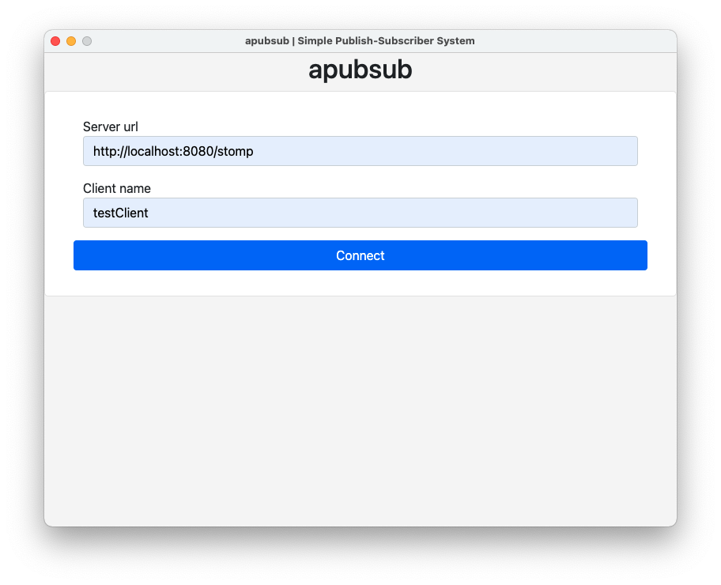
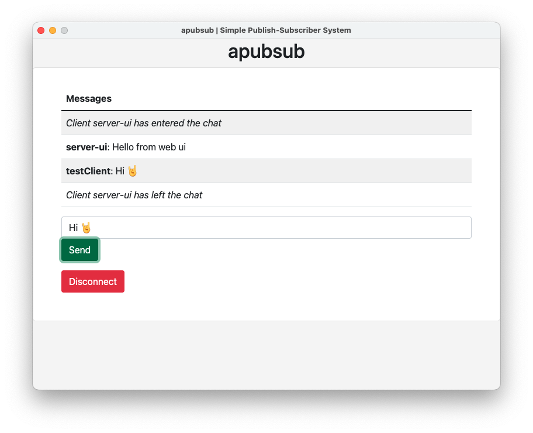

# Simple Publish-Subscriber System

[](https://github.com/jazzschmidt/gradle-docker-plugin/actions/workflows/ci.yml)

A very basic example of a pub-sub system, where a client can broadcast messages via a central server to all connected
clients.

The server is written as a simple _Spring Boot_ web app that simply exposes STOMP endpoints via WebSockets. Also, a
rudimentary client can be accessed over http. This enables testing between multiple clients, since the client
implementation is limited to run in one instance only.

The client is built using [NW.js](https://nwjs.io/), which seems to be a more efficient alternative
to [Electron](https://www.electronjs.org/).

## Build

The individual parts of this project are being built with different tools:

- **Maven Wrapper**
- **Docker**
- **npm**

There is a convenience bash script, that will perform all necessary build steps for you and will fail when an error
occurs: `full-build`. When targeting ARM architecture, supply the `--arm` flag. Erroneous builds will emit a log file
fou you to dig into the problems.

The output should look like this:

```bash
$ ./full-build --arm # omit parameter for x64 architectures
Building Server module... done!
Building Docker image... done!
Building Client module... done!


================================ SUMMARY ================================
    -- TYPE --     |                      -- DEST --
=========================================================================
Server jar         | server/target/server-0.0.1-SNAPSHOT.jar
Docker Image       | apubsub-server:latest
Client exe (win64) | client/dist/apubsub-client/win64/apubsub-client.exe
Client app (osx)   | client/dist/apubsub-client/osx64/apubsub-client.app
Client bin (linux) | client/dist/apubsub-client/linux64/apubsub-client
```

## Usage

After starting the Docker image, the port `8080` should be exposed on the host. Start the client application and fill
out the connection parameters. Since the client is limited to one instance, you can use the server rendered client UI on
its index page to connect an additional client.

When using custom clients, you should upgrade the http protocol to the STOMP protocol using the STOMP handshake
endpoint. Immediately register the client, to associate a specific name - otherwise `unregistered` will be shown for
every sent broadcast message.

**Default Endpoints:**

- `/stomp`: STOMP handshake and WebSocket upgrade; SockJS compatible
- `/app/register`: registering the client
- `/app/broadcast`: sending a broadcast message
- `/topic/broadcast`:  subscription of broadcast messages

### 1. Starting the server locally on standard http port

```
$ docker run --rm -p 80:8080 apubsub-server

  .   ____          _            __ _ _
 /\\ / ___'_ __ _ _(_)_ __  __ _ \ \ \ \
( ( )\___ | '_ | '_| | '_ \/ _` | \ \ \ \
 \\/  ___)| |_)| | | | | || (_| |  ) ) ) )
  '  |____| .__|_| |_|_| |_\__, | / / / /
 =========|_|==============|___/=/_/_/_/
 :: Spring Boot ::                (v2.6.3)

2022-01-29 21:43:49.056  INFO 1 --- [           main] c.g.j.apubsub.ServerApplication          : Starting ServerApplication v0.0.1-SNAPSHOT using Java 17.0.2 on fc8502b228b9 with PID 1 (/app.jar started by root in /)
2022-01-29 21:43:49.058  INFO 1 --- [           main] c.g.j.apubsub.ServerApplication          : No active profile set, falling back to default profiles: default
2022-01-29 21:43:49.633  INFO 1 --- [           main] o.s.b.w.embedded.tomcat.TomcatWebServer  : Tomcat initialized with port(s): 8080 (http)
2022-01-29 21:43:49.640  INFO 1 --- [           main] o.apache.catalina.core.StandardService   : Starting service [Tomcat]
2022-01-29 21:43:49.640  INFO 1 --- [           main] org.apache.catalina.core.StandardEngine  : Starting Servlet engine: [Apache Tomcat/9.0.56]
2022-01-29 21:43:49.679  INFO 1 --- [           main] o.a.c.c.C.[Tomcat].[localhost].[/]       : Initializing Spring embedded WebApplicationContext
2022-01-29 21:43:49.679  INFO 1 --- [           main] w.s.c.ServletWebServerApplicationContext : Root WebApplicationContext: initialization completed in 591 ms
2022-01-29 21:43:49.779  INFO 1 --- [           main] uration$$EnhancerBySpringCGLIB$$623a6648 : Initialized messaging with the following properties: 
{
    stompEndpoint: /stomp
    registration: /topic/register
    broadcast: /topic/messages
}
2022-01-29 21:43:49.957  INFO 1 --- [           main] o.s.b.a.w.s.WelcomePageHandlerMapping    : Adding welcome page: class path resource [static/index.html]
...
```

### 2. Configuring the Client

Enter the STOMP endpoint and connect:



### 3. Sending Messages

Now you can send messages to all connected clients.



## Caveats

While the server can be configured in many aspects and even validates its properties, the client does not fully comply
to those settings. More specific, modifying any endpoint prevents the client to connect.

The client registration is not enforced, which leads to unregistered clients being shown as `unregistered` in the
messages table.

The client has no error handling at all, since this would exceed the scope of this experiment.

Multiple instances of the client aren't supported, so you need to use the server rendered UI for multi-client scenarios.

The server rendered client UI has a fixed name: `server-ui`. Using multiple windows or tabs of that UI will work, but
messages cannot be specifically distinguished.
