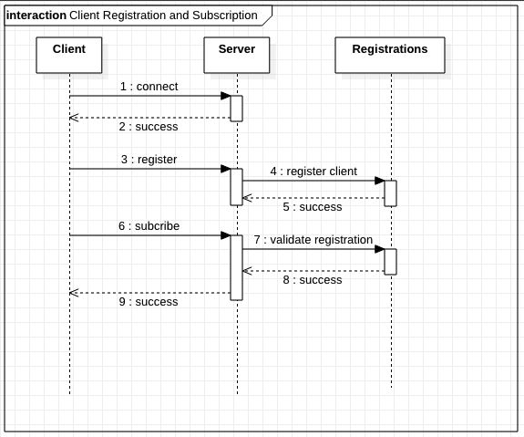

# Development

This document describes the high-level overview of the system and explains some design considerations worth mentionable.

## Client Registration

Before a client can subscribe to the `broadcast` topic, it needs to register itself with a name. Trying to subscribe
without a successful registration leads to the client being disconnected immediately.

This diagram shows the simplified process:

## Event Publishing

In order to decouple the components of the system, an event-driven architecture was chosen. Thereby a central Event
Listener, namely the [ClientEventListener](/apidocs/com/github/jazzschmidt/apubsub/ClientEventListener.html), consumes
[StompClientEvents](/apidocs/com/github/jazzschmidt/apubsub/events/StompClientEvent.html) of interest and publishes an
event, when a client connects, disconnects or registers itself.

The [ClientEventListener](/apidocs/com/github/jazzschmidt/apubsub/ClientEventListener.html) then instruct the
[NotificationService](/apidocs/com/github/jazzschmidt/apubsub/NotificationService.html) for example to announce newly
connected clients and those who just left.

## Channel Interceptors

Channel Interceptors monitor the STOMP channels and can react to, manipulate or drop the incoming messages.

The events previously mentioned are partly being raised by
the [ConnectionEventPublisher](/apidocs/com/github/jazzschmidt/apubsub/interceptor/ConnectionEventPublisher.html)
Interceptor, that transforms `CONNECT` and `DISCONNECT` messages from the STOMP protocol.

Apart from that publishing Interceptor, there is also
the [UnregisteredClientsGuard](/apidocs/com/github/jazzschmidt/apubsub/interceptor/UnregisteredClientsGuard.html) that
catches `SUBSCRIBE` messages and throws an exception for clients that are not registered yet and thus lead to those
clients being disconnected, which is the technical foundation of the client registration workflow.

## NW.js Client App

The first draft of the application was developed in an exploratory manner with the help
of [Getting Started | Using WebSocket to build an interactive web application](https://spring.io/guides/gs/messaging-stomp-websocket/)
. Since the client side was not at all stunning beautiful but sufficiently functional, it seemed to be an easy and good
idea to simply reuse those sources in a framework, that enables development of desktop applications using embedded web
technologies. In contrast to [Electron](https://www.electronjs.org/), [NW.js](https://nwjs.io/) claimed being less
resource hungry, which was a good fit for this project.

Therefore, the client was simply transferred with little effort and there was no need to reinvent the wheel.

?> Sadly, the UI on both the server rendered client and the client app won't win any prizes for sure.

## Spock Testing Framework

_Groovy_ comes in handy, especially when dealing with tests because of both its flexibility and simplicity. The
[Spock Framework](https://spockframework.org/) comes with superior Spring support, integrated stubbing and mocking
features, a coherent API - and is fun to use!

Also, in Groovy you can access `protected` and  `private` members, which only leads to a compiler warning and IntelliJ
refusing to autocomplete those specific statement.

There are quite a lot more features that simplify testing - if used with caution.

## Further Details

### Lombok

_Lombok_ manipulates source code, has some error-prone incompatibilities with IntelliJ (e.g. when referencing compiled
sources in a debug session where source files are not correctly mapped - which is not a thing you want to do while
debugging), and needlessly litter the build to simulate language features that are simply not present in current Java
versions. Therefore, the use of Lombok was discouraged in favour of using the capabilities of IntelliJ - namely
generating
_Getters_ and _Setters_. Since _Groovy_ and _Kotlin_, and possibly _Scala_ too, provide these features per se and mixing
these languages with Java is no hassle at all, there was no need to use Lombok, even if the models are getting any more
complex.

### Maven

_Maven_ is a strict and powerful build tool, that sure makes it possible to integrate custom workflows such as
assembling Docker images or building modules with a foreign build tool into its lifecycle, but for simplicity and for
the sake of rapidity, a simple _Bash script_ was authored that performs the full build of the application modules.
