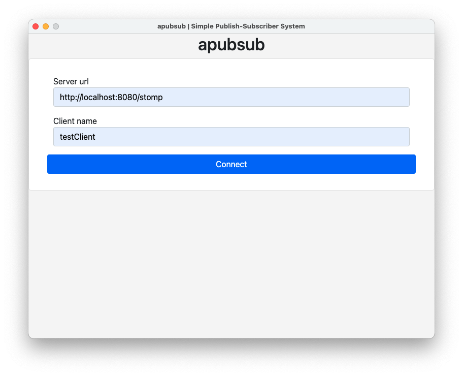

# Getting Started

You can either [download the latest release](https://github.com/jazzschmidt/apubsub/releases/latest) from GitHub or
build the modules on your own.

## Build

The individual parts of this project are being built with different tools:

- **Maven Wrapper**
- **Docker**
- **npm**

There is a convenience bash script, that will perform all necessary build steps for you and will fail when an error
occurs: `full-build`. Consult this script if you like to retrace. When targeting ARM architecture, supply the `--arm`
flag.

?> Erroneous builds will immediately stop and emit a log file for you to dig into the problems

The output should look like this:

```bash
$ ./full-build --arm # omit parameter for x64 architectures
Building Server module... done!
Building Docker image... done!
Building Client module... done!


================================ SUMMARY ================================
    -- TYPE --     |                      -- DEST --
=========================================================================
Server jar         | server/target/server-0.1.0.jar
Docker Image       | apubsub-server:latest, apubsub-server:0.1.0
Client exe (win64) | client/dist/apubsub-client/win64/apubsub-client.exe
Client app (osx)   | client/dist/apubsub-client/osx64/apubsub-client.app
Client bin (linux) | client/dist/apubsub-client/linux64/apubsub-client
```

## Usage

After starting the Docker image, Springs default http port `8080` should be exposed on the host. Start the client
application and fill out the connection parameters.

!> When using custom clients, you should immediately register the client to associate a specific name - otherwise your
client will be rejected when trying to subscribe to the broadcast topic.

**Default Endpoints:**

- `/`: Web client for testing
- `/stomp`: STOMP endpoint; SockJS compatible
- `/app/register`: registering the client
- `/app/broadcast`: sending a broadcast message
- `/topic/broadcast`:  subscription of broadcast messages

### Starting the Server

It's easy to start the server locally with docker, e.g. on standard http port:

```
$ docker run --rm -p 80:8080 apubsub-server # bind 8080 to standard http port 80

  .   ____          _            __ _ _
 /\\ / ___'_ __ _ _(_)_ __  __ _ \ \ \ \
( ( )\___ | '_ | '_| | '_ \/ _` | \ \ \ \
 \\/  ___)| |_)| | | | | || (_| |  ) ) ) )
  '  |____| .__|_| |_|_| |_\__, | / / / /
 =========|_|==============|___/=/_/_/_/
 :: Spring Boot ::                (v2.6.3)

2022-01-29 21:43:49.056  INFO 1 --- [           main] c.g.j.apubsub.ServerApplication          : Starting ServerApplication v0.0.1-SNAPSHOT using Java 17.0.2 on fc8502b228b9 with PID 1 (/app.jar started by root in /)
2022-01-29 21:43:49.058  INFO 1 --- [           main] c.g.j.apubsub.ServerApplication          : No active profile set, falling back to default profiles: default
2022-01-29 21:43:49.633  INFO 1 --- [           main] o.s.b.w.embedded.tomcat.TomcatWebServer  : Tomcat initialized with port(s): 8080 (http)
2022-01-29 21:43:49.640  INFO 1 --- [           main] o.apache.catalina.core.StandardService   : Starting service [Tomcat]
2022-01-29 21:43:49.640  INFO 1 --- [           main] org.apache.catalina.core.StandardEngine  : Starting Servlet engine: [Apache Tomcat/9.0.56]
2022-01-29 21:43:49.679  INFO 1 --- [           main] o.a.c.c.C.[Tomcat].[localhost].[/]       : Initializing Spring embedded WebApplicationContext
2022-01-29 21:43:49.679  INFO 1 --- [           main] w.s.c.ServletWebServerApplicationContext : Root WebApplicationContext: initialization completed in 591 ms
2022-01-29 21:43:49.779  INFO 1 --- [           main] uration$$EnhancerBySpringCGLIB$$623a6648 : Initialized messaging with the following properties: 
{
    stompEndpoint: /stomp
    registration: /topic/register
    broadcast: /topic/messages
}
2022-01-29 21:43:49.957  INFO 1 --- [           main] o.s.b.a.w.s.WelcomePageHandlerMapping    : Adding welcome page: class path resource [static/index.html]
...
```

### Configuring the Client

Enter the STOMP endpoint and connect:



### Sending Messages

Now you can send messages to all connected clients.

?> The client application is limited to run in a single instance. You can easily bypass this issue for testing by using
the Web UI, that is exposed on the server.


